# Federated Learning Framework

[](https://federa.readthedocs.io/en/latest/?badge=latest)
[](https://opensource.org/licenses/Apache-2.0)
[](https://github.com/anupam-kliv/fl_framework_initial/actions/workflows/ubuntu.yml)
[](https://github.com/anupam-kliv/fl_framework_initial/actions/workflows/windows.yml)
[](https://bestpractices.coreinfrastructure.org/projects/7362)

`FedERA` is a highly dynamic and customizable framework that can accommodate many use cases with flexibility by implementing several functionalities over different federated learning algorithms, and essentially creating a plug-and-play architecture to accommodate different use cases.

## Supported Devices

FedERA has been extensively tested on and works with the following devices:

* Intel CPUs
* Nvidia GPUs
* Nvidia Jetson
* Raspberry Pi
* Intel NUC

With `FedERA`, it is possible to operate the server and clients on **separate devices** or on a **single device** through various means, such as utilizing different terminals or implementing multiprocessing.

## Installation

- Install the latest version from source code:
```
$ git clone https://github.com/anupamkliv/FedERA.git
$ cd FedERA
$ pip install -r requirements.txt
```

<!-- - Install the stable version (old version) via pip:
```
# assign the version federa==1.1.2
$ pip install federa
``` -->

## Documentation

Website documentation has been made availbale for `FedERA`. Please visit [FedERA Documentation](https://federa.readthedocs.io/en/latest/index.html) for more details.

1. [Overview](https://federa.readthedocs.io/en/latest/overview.html)
2. [Installation](https://federa.readthedocs.io/en/latest/installation.html)
3. [Tutorials](https://federa.readthedocs.io/en/latest/tutorials.html)
4. [Contribution](https://federa.readthedocs.io/en/latest/contribution.html)
5. [API Reference](https://federa.readthedocs.io/en/latest/api.html)

## Starting server

```
python -m federa.server.start_server \
 --algorithm fedavg \
 --clients 2 \
 --rounds 10 \
 --epochs 10 \
 --batch_size 10 \
 --lr 0.01 \
 --dataset mnist \
```

## Starting client

```
python -m federa.client.start_client \
 --ip localhost:8214 \
 --device cpu \
```

## Using Docker

Create a docker image
```
docker build -t federa .
```

Run the docker image

```
docker run federa
```

## Arguments to the clients and server

### Server

| Argument   | Description                                                  | Default |
| ---------- | ------------------------------------------------------------ | ------- |
| algorithm  | specifies the aggregation algorithm                          | fedavg  |
| clients    | specifies number of clients selected per round              | 2       |
| fraction   | specifies fraction of clients selected                      | 1       |
| rounds     | specifies total number of rounds                            | 2       |
| model_path | specifies initial server model path                         | initial_model.pt |
| epochs     | specifies client epochs per round                           | 1       |
| accept_conn| determines if connections accepted after FL begins          | 1       |
| verify     | specifies if verification module runs before rounds         | 0       |
| threshold  | specifies minimum verification score                        | 0       |
| timeout    | specifies client training time limit per round              | None    |
| resize_size| specifies dataset resize dimension                          | 32      |
| batch_size | specifies dataset batch size                                | 32      |
| net        | specifies network architecture                              | LeNet   |
| dataset    | specifies dataset name                                      | FashionMNIST |
| niid       | specifies data distribution among clients                   | 1       |
| carbon     | specifies if carbon emissions tracked at client side        | 0       |
| encryption | specifies whether to use ssl encryption or not              | 0       |
| server_key   | specifies path to server key certificate                  | server-key.pem|
| server_cert  | specifies path to server certificate                      | server.pem| 

### Client

| Argument   | Description                                                  | Default |
| ---------- | ------------------------------------------------------------ | ------- |
| server_ip  | specifies server IP address                                 | localhost:8214 |
| device     | specifies device                                            | cpu     |
| encryption | specifies whether to use ssl encryption or not              | 0       |
| ca         | specifies path to CA certificate                             | ca.pem|

## Architecture
Files architecture of `FedERA`. These contents may be helpful for users to understand our repo.

```
FedERA
├── federa
│   ├── client
│   │   ├── src
│   |   |   ├── client_lib
│   |   |   ├── client
│   |   |   ├── ClientConnection_pb2_grpc
│   |   |   ├── ClientConnection_pb2
│   |   |   ├── data_utils
│   |   |   ├── distribution
│   |   |   ├── get_data
│   |   |   ├── net_lib
│   |   |   ├── net
│   │   └── start_client
│   └── server
│       ├── src
│       |   ├── algorithms
│       |   ├── server_evaluate
│       |   ├── client_connection_servicer
│       |   ├── client_manager
│       |   ├── client_wrapper
│       |   ├── ClientConnection_pb2_grpc
│       |   ├── ClientConnection_pb2
│       |   ├── server_lib
│       |   ├── server
│       |   ├── verification
│       └── start_server
└── test
    ├── misc
    ├── benchtest
    |   ├── test_algorithms
    |   ├── test_datasets
    |   ├── test_models
    |   ├── test_modules
    |   ├── test_results
    |   └── test_scalability
    └──unittest
        └── test_algorithms
        
```

## The framework is be composed of 4 modules, each module building upon the last:

* **Module 1: Verification module** [docs](https://federa.readthedocs.io/en/latest/overview.html#verification-module)
* **Module 2: Timeout module** [docs](https://federa.readthedocs.io/en/latest/overview.html#timeout-module)
* **Module 3: Intermediate client connections module** [docs](https://federa.readthedocs.io/en/latest/overview.html#intermediate-client-connections-module)
* **Module 4: Carbon emission tracking module** [docs](https://federa.readthedocs.io/en/latest/overview.html#carbon-emissions-tracking-module)

## Running tests

Various unit tests are available in the `test` directory. To run any tests, run the following command from the root directory:

```
python -m test.benchtest.test_algorithms
python -m test.benchtest.test_datasets
python -m test.benchtest.test_models
python -m test.benchtest.test_modules
python -m test.benchtest.test_scalability
```

## Federated Learning Algorithms

Following federated learning algorithms are implemented in this framework:

| Method              | Paper                                                        | Publication                                     |
| ------------------- | ------------------------------------------------------------ | ---------------------------------------------------- |
| FedAvg              | [Communication-Efficient Learning of Deep Networks from Decentralized Data](http://proceedings.mlr.press/v54/mcmahan17a/mcmahan17a.pdf) | AISTATS'2017 |                                                      
| FedDyn              | [Federated Learning Based on Dynamic Regularization](https://openreview.net/forum?id=B7v4QMR6Z9w) | ICLR' 2021   |          
| Scaffold           | [SCAFFOLD: Stochastic Controlled Averaging for Federated Learning]() | ICML'2020    |
| Personalized FedAvg | [Improving Federated Learning Personalization via Model Agnostic Meta Learning](https://arxiv.org/pdf/1909.12488.pdf) |    Pre-print      |                                                      
| FedAdagrad          | [Adaptive Federated Optimization](https://arxiv.org/pdf/2003.00295.pdf) | ICML'2020    |                                                       
| FedAdam       | [Adaptive Federated Optimization](https://arxiv.org/pdf/2003.00295.pdf) | ICML'2020    |                                                      
| FedYogi    | [Adaptive Federated Optimization](https://arxiv.org/pdf/2003.00295.pdf) | ICML'2020    |                                                      
| Mime       | [Mime: Mimicking Centralized Stochastic Algorithms in Federated Learning](https://arxiv.org/pdf/2008.03606.pdf) | ICML'2020    |                                                      
| Mimelite       | [Mime: Mimicking Centralized Stochastic Algorithms in Federated Learning](https://arxiv.org/pdf/2008.03606.pdf) | ICML'2020    |                                                      

## Datasets & Data Partition

Sophisticated in the real world, FL needs to handle various kind of data distribution scenarios, including iid and non-iid scenarios. Though there already exists some datasets and partition schemes for published data benchmark, it still can be very messy and hard for researchers to partition datasets according to their specific research problems, and maintain partition results during simulation.

### Data Partition

We provide multiple Non-IID data partition schemes. Here we show the data partition visualization of several common used datasets as the examples.

#### Balanced IID partition

Each client has same number of samples, and same distribution for all class samples. 

<div align="left">
  
   
</div>


#### Non-IID partition 2

<div align="left">
    
    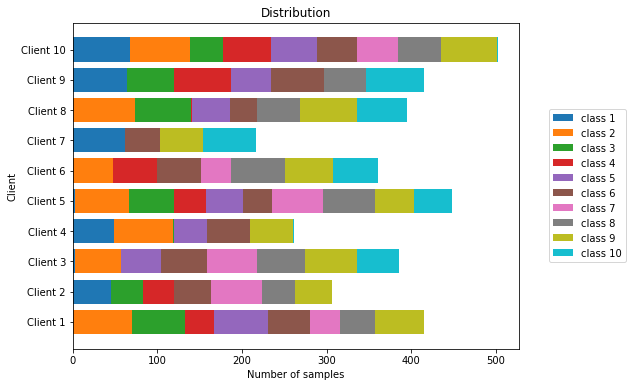
</div>

#### Non-IID partition 3

<div align="left">
    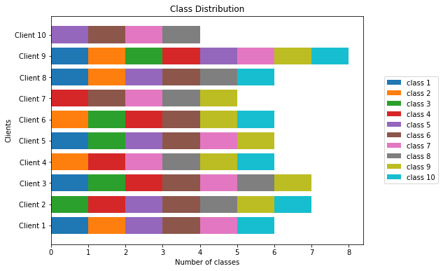
    
</div>

<!-- #### Non-IID partition 4

<div align="left">
    
    
</div>

#### Non-IID partition 5

<div align="left">
    
    
</div> -->

### Datasets Supported

| Dataset                | Training samples         | Test samples       | Classes 
| ---------------------- | ------------------------ | ------------------ | ------------------ |
| MNIST                  | 60,000                   | 10,000             | 10                 |
| FashionMnist           | 60,000                   | 10,000             | 10                 |
| CIFAR-10               | 50,000                   | 10,000             | 10                 |
| CIFAR-100              | 50,000                   | 10,000             | 100                |

### Custom Dataset Support

We also provide a simple way to add your own dataset to the framework. Look into [docs](https://federa.readthedocs.io/en/latest/tutorials/dataset.html#adding-support-for-new-datasets) for more details.

## Models Supported

`FedERA` has support for the following Deep Learning models, which are loaded from `torchvision.models`:

* LeNet
* ResNet18
* ResNet50
* VGG16
* AlexNet

### Custom Model Support

We also provide a simple way to add your own models to the framework. Look into [docs](https://federa.readthedocs.io/en/latest/tutorials/dataset.html#adding-support-for-new-datasets) for more details.

## Carbon emission tracking

In `FedERA` CodeCarbon[[1]](#1)  package is used to estimate the carbon emissions generated by clients during training. CodeCarbon is a Python package that provides an estimation of the carbon emissions associated with software code.

### Nvidia gpu

---

### raspberry pi

---

## Performance Evaluation under different Non-IID setting
<!--
The `accuracy.py`  file has functions defined needed to plot all the graphs show in this section.

### Accuracy of various FL algorithms available in the framework with a few dataset

<br>

<div align="center">
<table style="margin: auto">
    <thead>
        <tr>
            <th>Dataset</th>
            <th colspan=3>MNIST</th>
            <th colspan=3>CIFAR-10</th>
            <th colspan=3>CIFAR-100</th>
        </tr>
    </thead>
    <tbody>
        <tr>
            <td  style="text-align: center" >Algorithm </td>
            <td  style="text-align: center">K=1</td>
            <td  style="text-align: center">K=2</td>
            <td  style="text-align: center">K=3</td>
            <td  style="text-align: center">K=1</td>
            <td  style="text-align: center">K=2</td>
            <td  style="text-align: center">K=3</td>
            <td  style="text-align: center">K=1</td>
            <td  style="text-align: center">K=2</td>
            <td  style="text-align: center">K=3</td>
        </tr>
        <tr>
            <td>FedAvg </td>
            <td></td>
            <td></td>
            <td></td>
            <td></td>
            <td></td>
            <td></td>
             <td></td>
            <td></td>
            <td></td>
        </tr>
        <tr>
            <td>FedAvgM </td>
            <td></td>
            <td></td>
            <td></td>
            <td></td>
            <td></td>
            <td></td>
             <td></td>
            <td></td>
            <td></td>
        </tr>
         <tr>
            <td>FedAdam </td>
            <td></td>
            <td></td>
            <td></td>
            <td></td>
            <td></td>
            <td></td>
             <td></td>
            <td></td>
            <td></td>
        </tr>
         <tr>
            <td>FedAdagrad </td>
            <td></td>
            <td></td>
            <td></td>
            <td></td>
            <td></td>
            <td></td>
             <td></td>
            <td></td>
            <td></td>
        </tr>
         <tr>
            <td>FedYogi </td>
            <td></td>
            <td></td>
            <td></td>
            <td></td>
            <td></td>
            <td></td>
             <td></td>
            <td></td>
            <td></td>
        </tr>
 <tr>
            <td>Mime </td>
            <td></td>
            <td></td>
            <td></td>
            <td></td>
            <td></td>
            <td></td>
             <td></td>
            <td></td>
            <td></td>
        </tr>
        <tr>
            <td>Mimelite </td>
            <td></td>
            <td></td>
            <td></td>
            <td></td>
            <td></td>
            <td></td>
             <td></td>
            <td></td>
            <td></td>
        </tr>
         <tr>
            <td>FedDyn </td>
            <td></td>
            <td></td>
            <td></td>
            <td></td>
            <td></td>
            <td></td>
             <td></td>
            <td></td>
            <td></td>
        </tr>
         <tr>
            <td>Scaffold </td>
            <td></td>
            <td></td>
            <td></td>
            <td></td>
            <td></td>
            <td></td>
             <td></td>
            <td></td>
            <td></td>
        </tr>
         <tr>
            <td>Personalized-FedAvg </td>
            <td></td>
            <td></td>
            <td></td>
            <td></td>
            <td></td>
            <td></td>
             <td></td>
            <td></td>
            <td></td>
        </tr>
    </tbody>
</table>
</div>
-->
### Plotting the accuracy of some algorithms against different Non-IID distributions

<div align="left">
  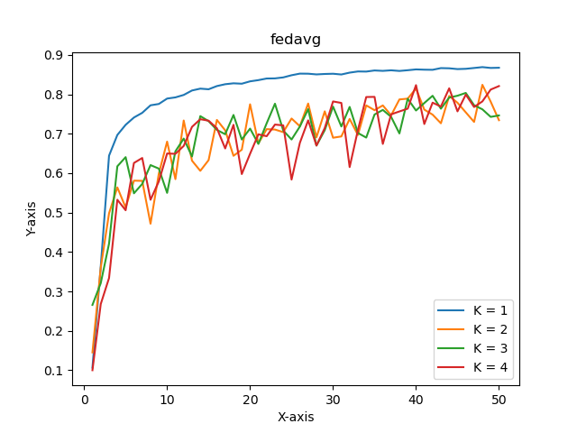
  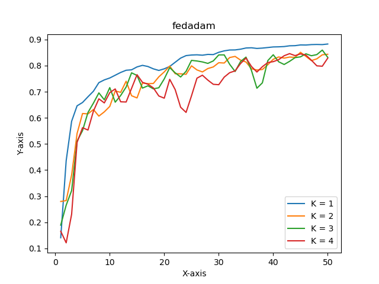 
  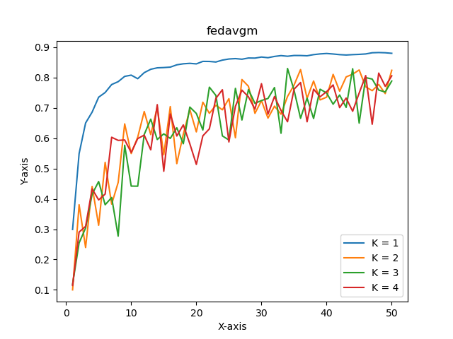
  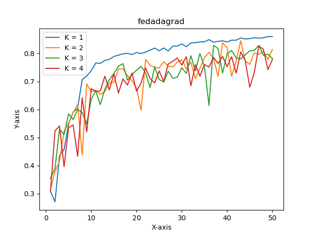
</div>

### Plotting accuracy on Non-IID distribution with different algorithms

<div align="left">
  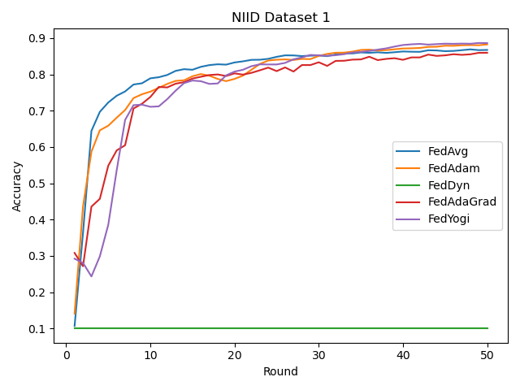
  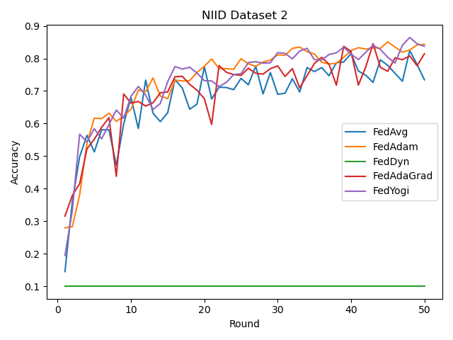
  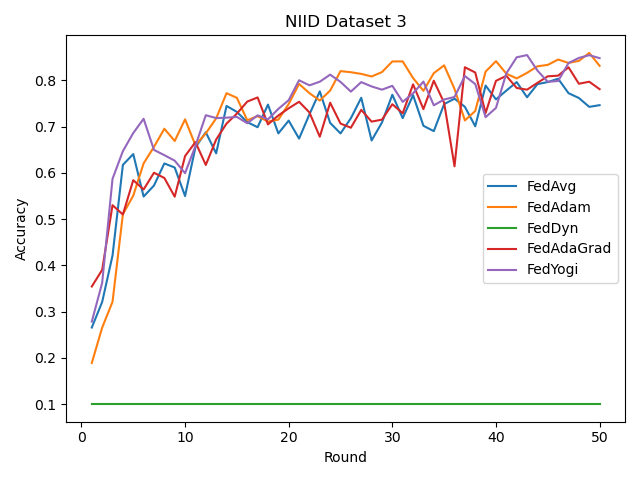
  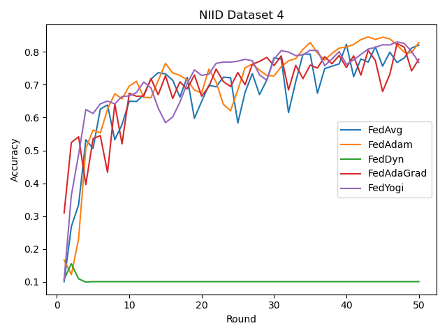
</div>
<br/>


### Comparing accuracy of different algorithm with different Non-IID distributions

<div align="center">
  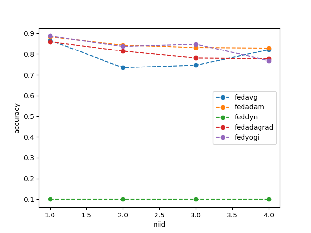
</div>
 
<!-- ## References

<a id="1">[1]</a> Schmidt, V., Goyal, K., Joshi, A., Feld, B., Conell, L., Laskaris, N., Blank, D., Wilson, J., Friedler, S., & Luccioni, S. (2021). CodeCarbon: Estimate and Track Carbon Emissions from Machine Learning Computing. https://doi.org/10.5281/zenodo.4658424

<a id="2">[2]</a> -->

## Contact

<!-- Project Investigator: [Prof. ](https://scholar.google.com/citations?user=gF0H9nEAAAAJ&hl=ennjujbj) (abc@edu).

For technical issues related to __**FedERA**__ development, please contact our development team through Github issues or email:

- [Name Sirname](https://scholar.google.com/citations___): _____@gmail.com -->

For technical issues related to __**FedERA**__ development, please contact our development team through Github issues or email:

**Principal Investigator**


<a href="https://www.linkedin.com/in/debdoot/">Dr Debdoot Sheet</a> </br>
Department of Electrical Engineering,</br>
Indian Institute of Technology Kharagpur</br>
email: debdoot@ee.iitkgp.ac.in, 


**Contributor**

<a href="https://in.linkedin.com/in/anupam-borthakur-b85000185/">Anupam Borthakur</a> </br>
Centre of Excellence in Artificial Intelligence, </br>
Indian Institute of Technology Kharagpur </br>
email: anupamborthakur@kgpian.iitkgp.ac.in </br>
Github username: anupam-kliv

<a href="https://www.linkedin.com/in/asimmanna17/">Asim Manna</a> </br>
Centre of Excellence in Artificial Intelligence, </br>
Indian Institute of Technology Kharagpur </br>
email: asimmanna17@kgpian.iitkgp.ac.in </br> 
Github username: asimmanna17


<a href="https://github.com/Rakshith2597"> Aditya Kasliwal</a></br>
Manipal Institute of Technology</br>
email: kasliwaladitya17@gmail.com </br>
Github username: Kasliwal17

<a href="https://www.linkedin.com/in/asimmanna17/">Dipayan Dewan</a> </br>
Centre of Excellence in Artificial Intelligence, </br>
Indian Institute of Technology Kharagpur </br>
email: diipayan92@kgpian.iitkgp.ac.in </br>
 
