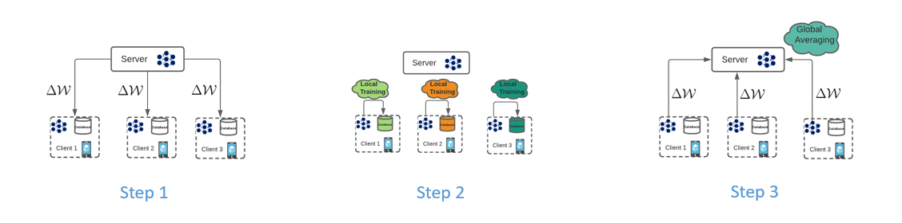
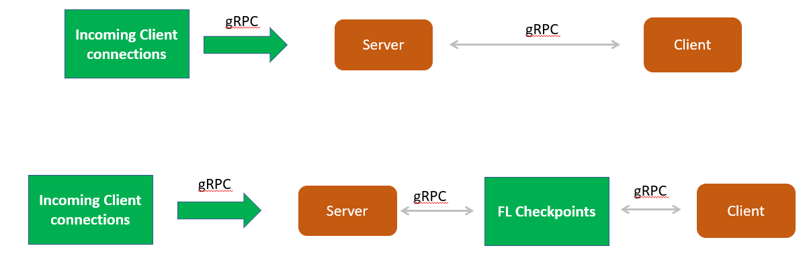
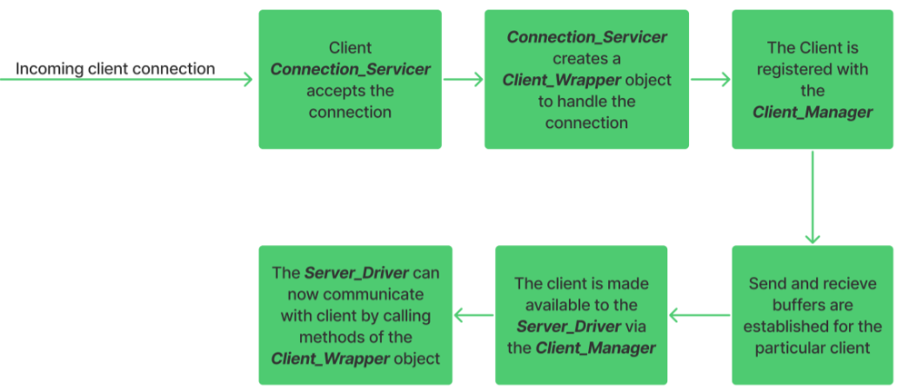
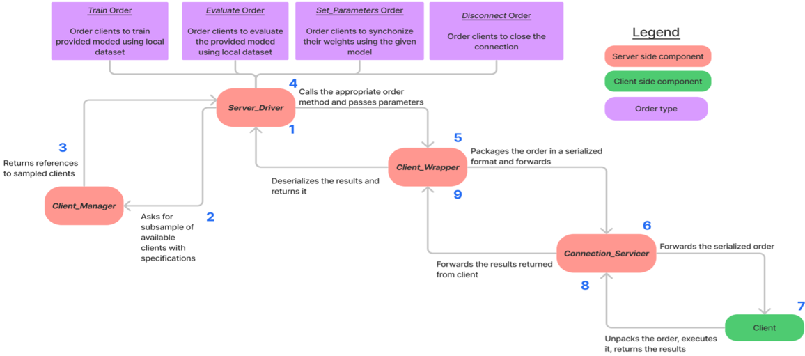
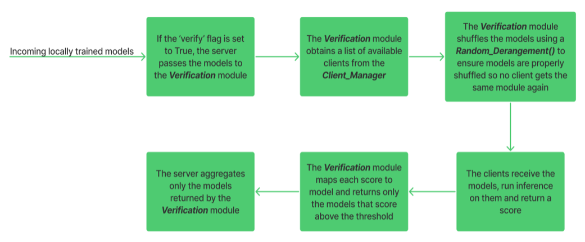
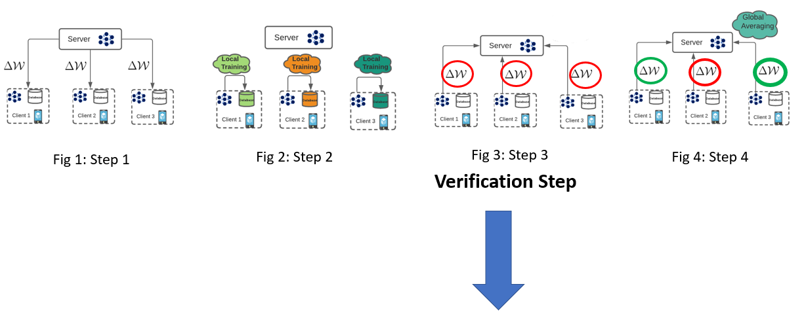
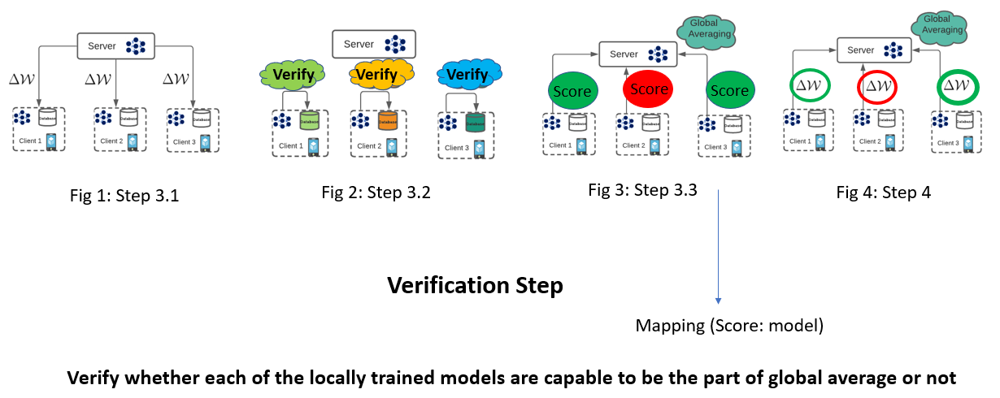
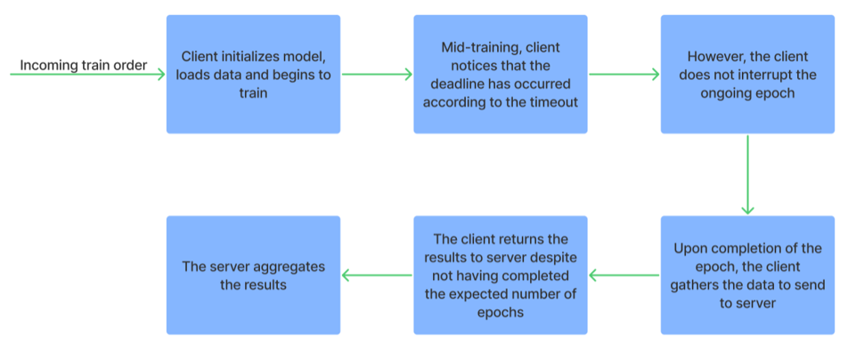
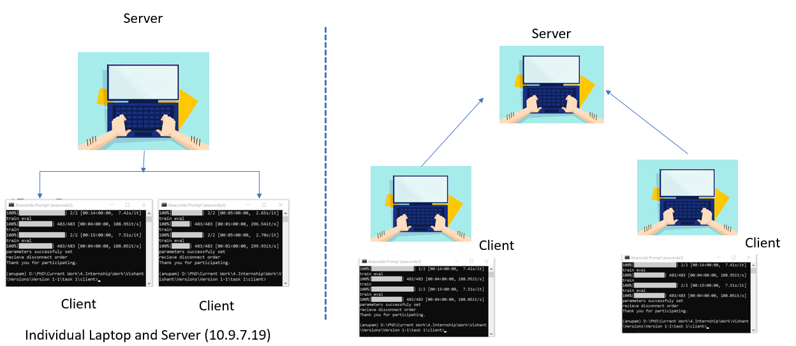

.. _overview:

******************
Overview of FedERA
******************

Introduction
============

Federated Learning is a machine learning technique for training models on distributed data without sharing it. In traditional machine learning, large datasets must first be collected and then sent to one location where they can be combined before the model is trained on them. However, this process can cause privacy concerns as sensitive personal data may become publicly available. Federated learning attempts to address these concerns by keeping individual user's data local while still allowing for powerful powerful statistical analysis that can be used to create accurate models at scale.

**FedAvg** is one of the foundational blocks of federated learning. A single communication round of FedAvg includes:

* Waiting for a number of clients to connect to a server (Step 0)
* Sending the clients a  global model (Step 1)
* Train the model with locally available data (Step 2)
* Send the trained models back to the server (Step 3)

The server then averages the weights of the models and calculates a new aggregated model. This process constitutes a single communication round and several such communication rounds occur to train a model.

..    :class: only-light

Overview
========

**FedERA** is a highly dynamic and customizable framework that can accommodate many use cases with flexibility by implementing several functionalities over vanilla FedAvg, and essentially creating a plug-and-play architecture to accommodate different use cases.

Federated Learning
------------------

|
|

Establishing Connection between Server and Clients
~~~~~~~~~~~~~~~~~~~~~~~~~~~~~~~~~~~~~~~~~~~~~~~~~~

|
|

Communication with clients
~~~~~~~~~~~~~~~~~~~~~~~~~~

|
|

Fractional and random subsampling
~~~~~~~~~~~~~~~~~~~~~~~~~~~~~~~~~

* The Client_Manager can be used to sample the already connected clients.
* A minimum number of clients can be provided, upon which the Client_Manager will wait for that many clients to connect before returning a reference to them. 

   * If a fraction is provided, the Client_Manager will return that fraction of available clients.
   * The Client_Manager can sample the clients based on their connection order or a random order. A function can also be provided to determine the selection of clients.

Various modules in Feder
------------------------

Feder is composed of 4 modules, each module building upon the last.

1. **Verification module.** Before aggregating, the server will perform a special verification round to determine which models to accommodate during aggregation.

2. **Timeout module.** Instead of waiting indefinitely for a client to finish training, the server will be able to issue a timeout, upon the completion of which, even if it hasn’t completed all epochs, the client will stop training and return the results.

3. **Intermediate client connections module.** New clients will be able to join the server anytime and may even be included in a round that is already live.

4. **Carbon emissions tracking module.** The framework will be able to track the carbon emissions of the clients during the training process.

Verification module
----------------------------

* After the server receives the trained weights, it aggregates all of them to form the new model. However, the selection of models for aggregation can be modified.
* Before aggregation, the server passes the models to a Verification module, which then uses a predefined procedure to generate scores for models, and then returns only those models that have performed above a defined threshold.
* The Verification module can be easily customized.

Steps in the Verification module
~~~~~~~~~~~~~~~~~~~~~~~~~~~~~~~~~

|
|

Modified Federated Learning architecture
~~~~~~~~~~~~~~~~~~~~~~~~~~~~~~~~~~~~~~~~

|
|

Timeout module
--------------

* Often in real world scenarios, clients cannot keep training indefinitely. Therefore, a timeout functionality has been implemented.
* The server can specify a timeout parameter as a Train order configuration. The client will then train till the timeout occurs, and then return the results.

Steps in the Timeout module
~~~~~~~~~~~~~~~~~~~~~~~~~~~

|

Intermediate client connections module
--------------------------------------

* Now, even during the middle of a communication round, the server can accept new client connections, incorporate them into the Client_Manager and even include them in the ongoing communication round as well.
* The server can be easily configured to allow or reject new connections during different parts of Federated Learning.
* Safeguards to notify when a client has disconnected anytime have been implemented.

Carbon emissions tracking module
--------------------------------

In **FedERA** CodeCarbon package is used to estimate the carbon emissions generated by clients during training. CodeCarbon is a Python package that provides an estimation of the carbon emissions associated with software code.

Tested on
~~~~~~~~~

**FedERA** has been extensively tested on and works with the following devices:

* Intel CPUs
* Nvidia GPUs
* Nvidia Jetson
* Raspberry Pi
* Intel NUC

With Feder, it is possible to operate the server and clients on separate devices or on a single device through various means, such as utilizing different terminals or implementing multiprocessing.

